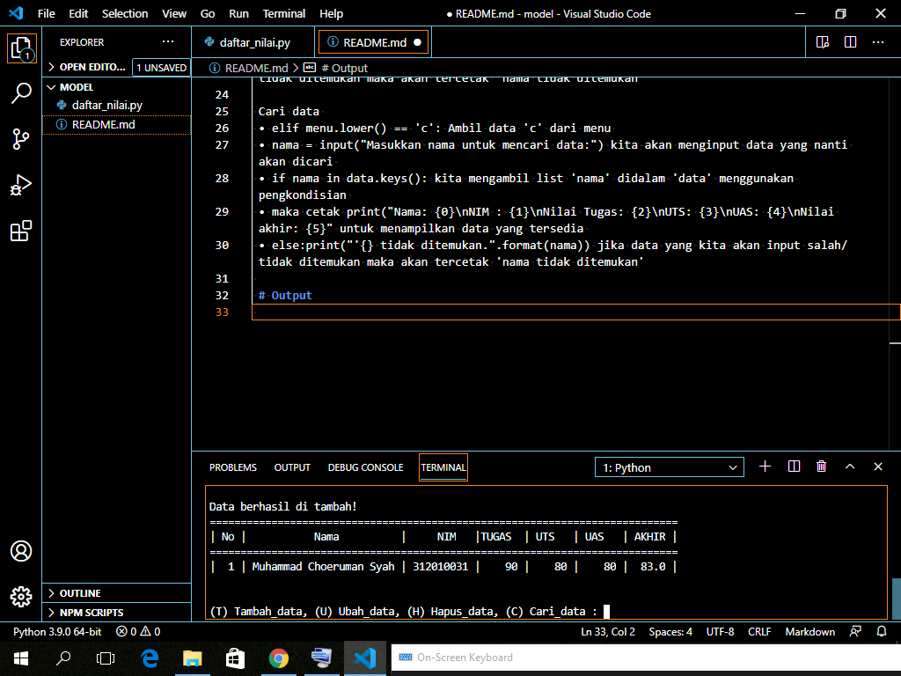
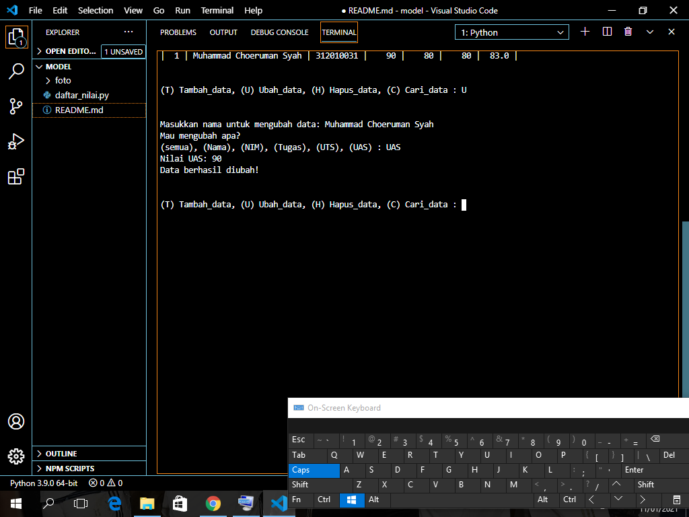
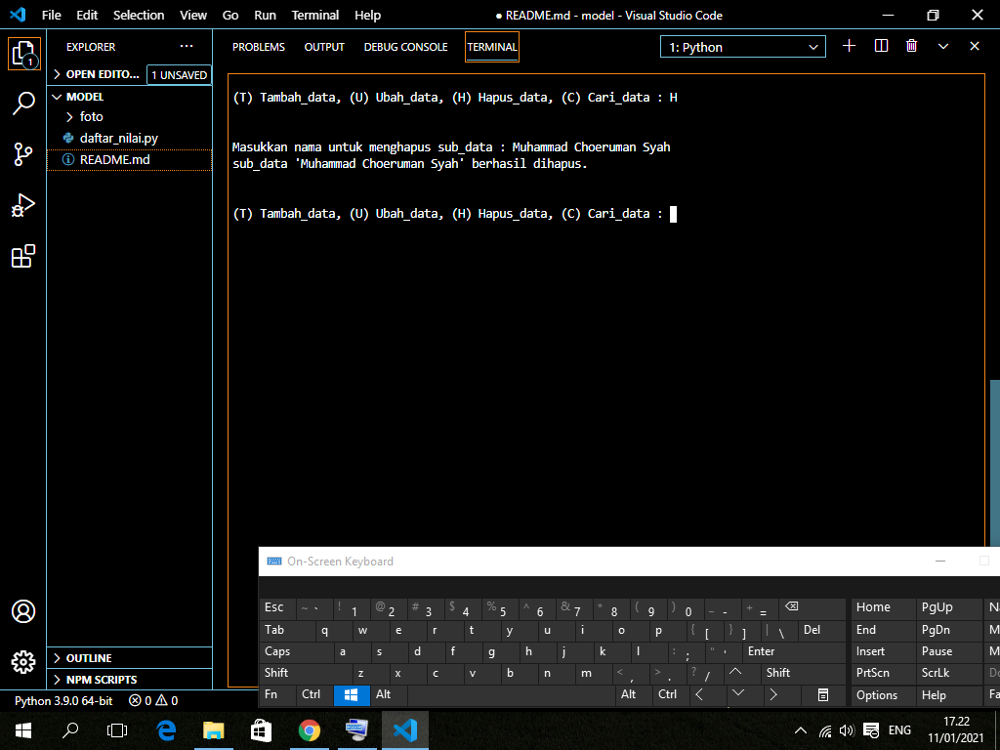
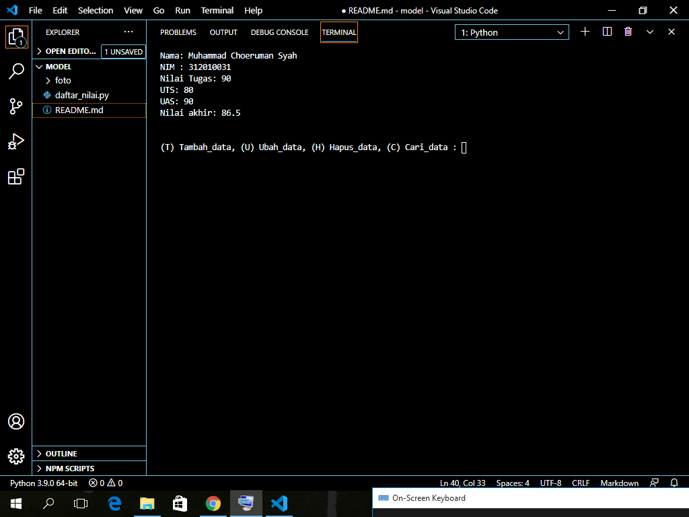

Tambah data • elif menu.lower() == 't': Ambil data 't' dari menu
    • nama = input("Masukkan nama: ") lalu tambahkan input nama, nim, nilai tugas, nilai uts, nilai uas 
    • nilai_akhir = (nilai_tugas)*30/100 + (nilai_uts)*35/100 + (nilai_uas)*35/100 untuk nilai akhir diambil dari perhitungan 3 komponen nilai(nilai_tugas:30%, nilai_uts:35%, nilai_uas:35%)
    • data[nama] = [nama, nim, nilai_tugas, nilai_uts, nilai_uas, nilai_akhir] kita akan masukkan data yang tadi kita input ke dalam 'data[nama]' • lalu cetak print()

Ubah data 
 • elif menu.lower() == 'u': Ambil data 'u' dari menu
 • nama = input("Masukkan nama untuk mengubah data: ") kita akan menginput data yang nanti akan diubah 
 • if nama in data.keys(): print("Mau mengubah apa?") jika 'nama' dari didalam 'data' maka akan mengembalikan daftar menggunakan daftar menggunakan fungsi 'keys()' 
 • sub_data = input("(semua), (Nama), (NIM),(Tugas), (UTS), (UAS) : ") membuat menu diubah didalam sub_data 
 • if sub_data.lower() =="semua": ambil kata kunci 'semua di dalam sub_data jika 'semua' maka input data[nama][1] = input("Ubah NIM: ")data[nama][2] = int(input("Ubah Nilai Tugas: ")) data[nama][3] = int(input("Ubah Nilai UTS: ")) data[nama][4] = int(input("Ubah Nilai UAS: ")) data[nama][5] = data[nama][2] *30/100 + data[nama][3] + data[nama][4] = int (input("ubah Nilai UAS:")) 
 • data[nama][5] = data[nama][2] *30/100 + data[nama][3]*35/100 + data[nama][4]*35/100 kita dapatkan nilai akhir dengan diambil dari perhitungan 3 komponen nilai(tugas: 30%, uts: 35%, uas: 35%), ket: [5] = nilai_akhir, dimana[0] = nama 
 • lalu cetak print("\Berhasil ubah data!") • Jika kita ingin mengubah data tertentu maka elif sub_data.lower() == "nim":data[nama][1] = input("NIM:") dan berlaku juga untuk nilai tugas, UTS, dan UAS 
 • lalu cetak print("\Berhasil ubah data!") 
 • else:print("'{}' tidak ditemukan.".format(nama)) jika kita salah dalam memasukkan nama untuk mengubah data maka akan muncul 'nama tidak ditemukan'

 Hapus data 
 • elif menu.lower() 'h': Ambil data 'c' dari menu 
 • nama = input("Masukkan nama untuk menghapus sub_data : ") kita akan menginput data yang nanti akan dihapus 
 • if nama in data.keys(): kita mengambil list 'nama' didalam 'data' menggunakan pengkondisian 
 • del data[nama] hapus semua nam yang ada didalam 'data' 
 • jika sudah maka cetak print("sub_data '{}' berhasil dihapus.".format(nama)) 
 • else:print("'{} tidak ditemukan.".format(nama)) jika data yang kita akan input salah/tidak ditemukan maka akan tercetak 'nama tidak ditemukan'

 Cari data 
 • elif menu.lower() == 'c': Ambil data 'c' dari menu 
 • nama = input("Masukkan nama untuk mencari data:") kita akan menginput data yang nanti akan dicari 
 • if nama in data.keys(): kita mengambil list 'nama' didalam 'data' menggunakan pengkondisian 
 • maka cetak print("Nama: {0}\nNIM : {1}\nNilai Tugas: {2}\nUTS: {3}\nUAS: {4}\nNilai akhir: {5}" untuk menampilkan data yang tersedia 
 • else:print("'{} tidak ditemukan.".format(nama)) jika data yang kita akan input salah/tidak ditemukan maka akan tercetak 'nama tidak ditemukan'
 
 # Output
 Tambah data:
 

 Ubah data:
 

 Hapus data:
 

 Cari data:
 