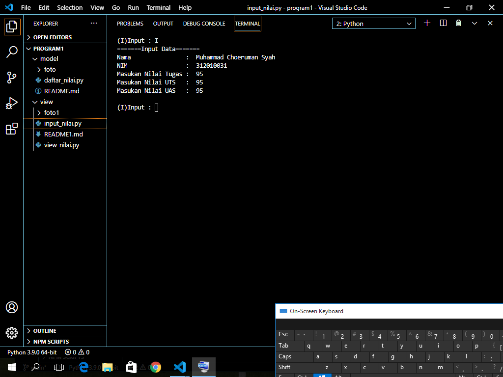

# Mencetak daftar nilai
 if c.lower() == 'i':  Kita menggunakan kondisi percabangan if, ambil data dari menu lalu kita akan mengubah perintah 'i' yang kita input menjadi huruf kecil dengan fungsi lower()
• lalu cetak print()

 Output:
 
 