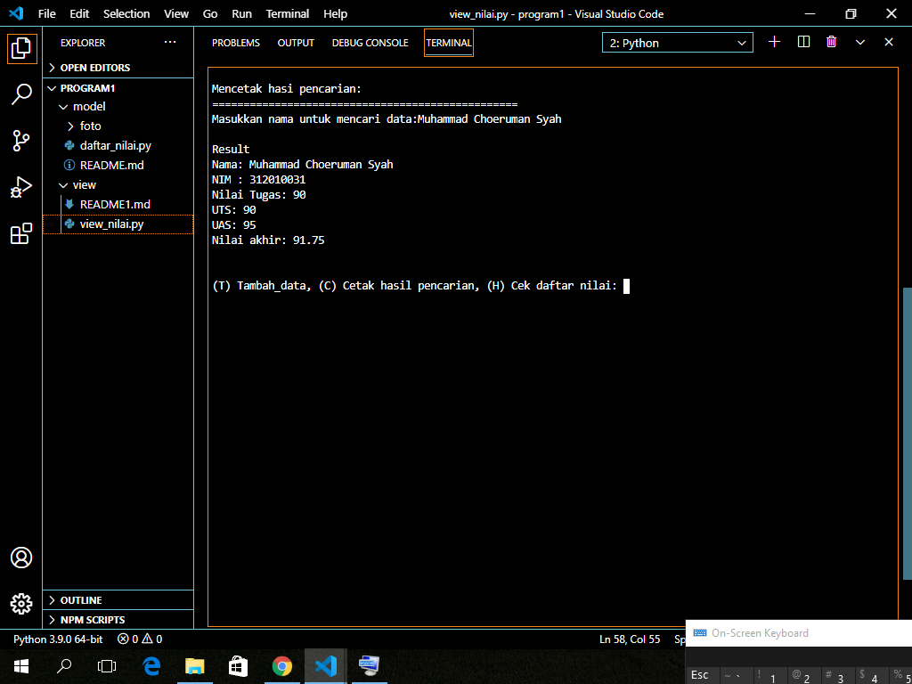
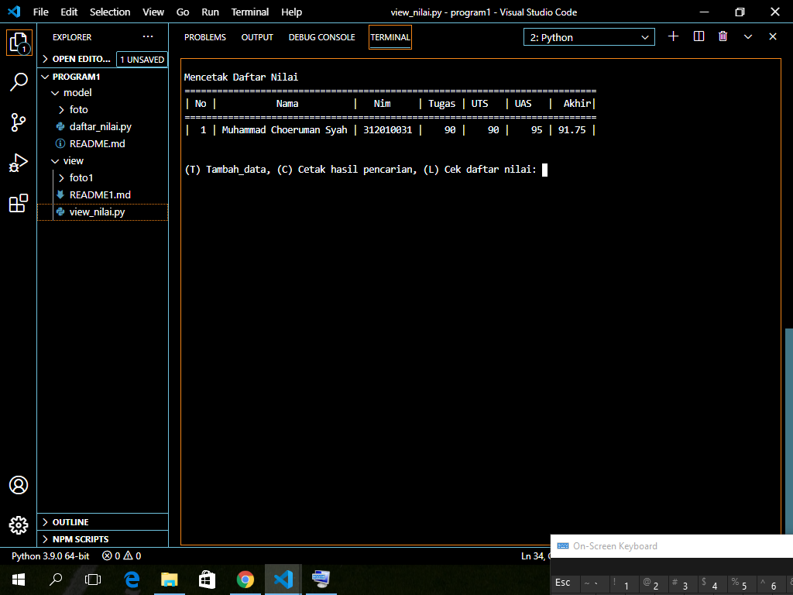

# Cetak hasil pencarian
 • elif menu.lower() == 'c': Ambil data 'c' dari menu 
 • nama = input("Masukkan nama untuk mencari data:") kita akan menginput data yang nanti akan dicari 
 • if nama in data.keys(): kita mengambil list 'nama' didalam 'data' menggunakan pengkondisian 
 • maka cetak print("Nama: {0}\nNIM : {1}\nNilai Tugas: {2}\nUTS: {3}\nUAS: {4}\nNilai akhir: {5}" untuk menampilkan data yang tersedia 
 • else:print("'{} tidak ditemukan.".format(nama)) jika data yang kita akan input salah/tidak ditemukan maka akan tercetak 'nama tidak ditemukan'
 Output:
 

 # Mencetak daftar nilai
  elif menu.lower() == 'l': Kita menggunakan kondisi percabangan if, ambil data dari menu lalu kita akan mengubah perintah 'l' yang kita input menjadi huruf kecil dengan fungsi lower()
• lalu cetak print()
Output:
